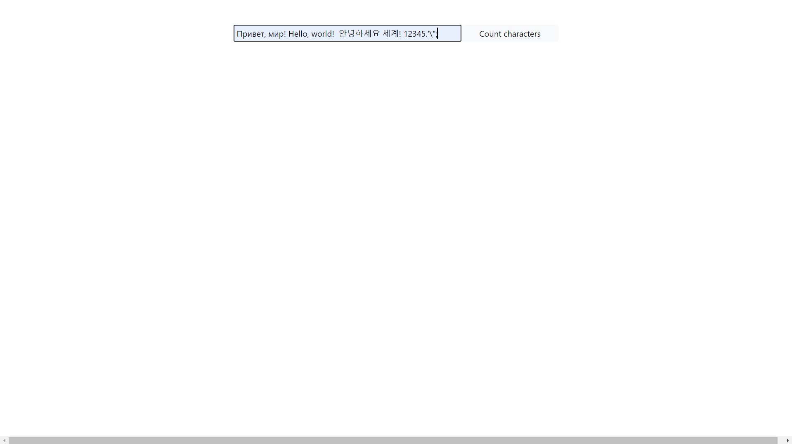
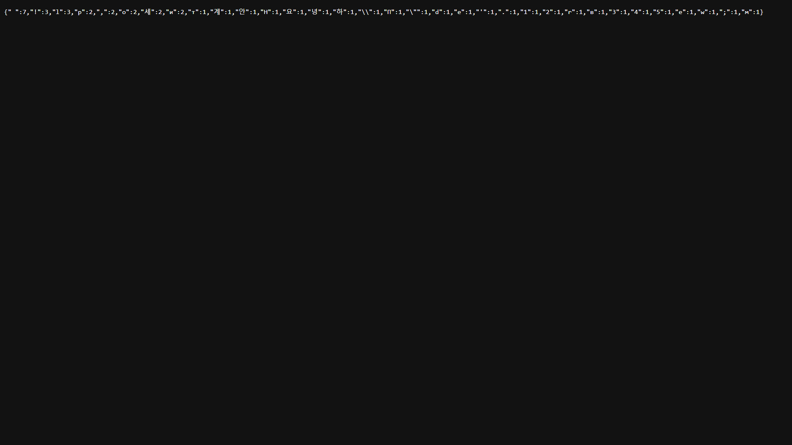
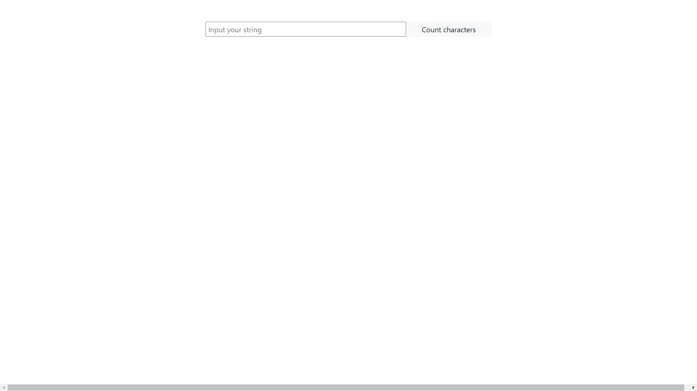
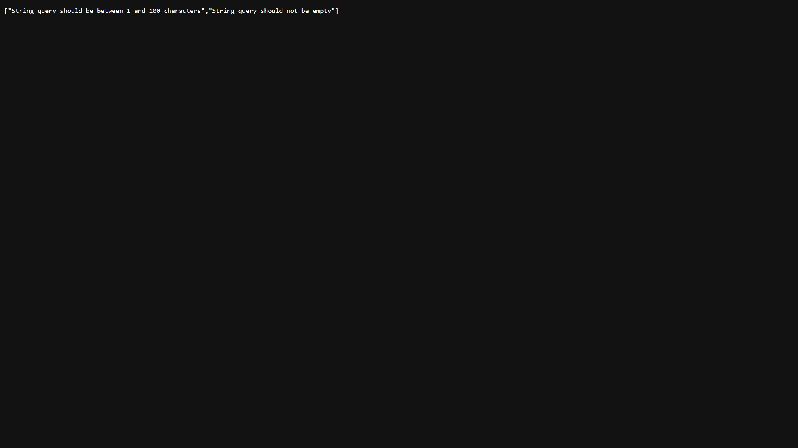
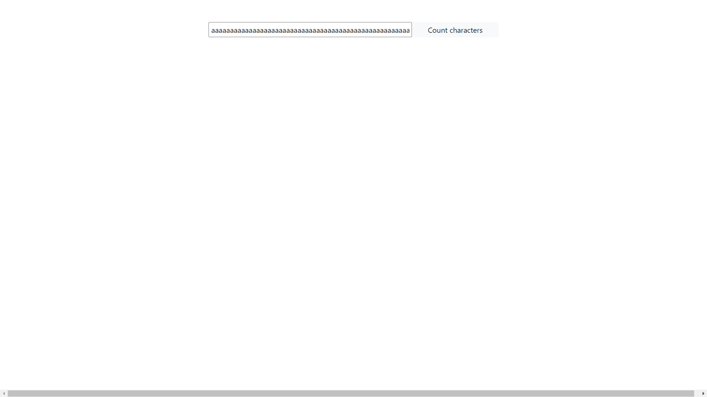
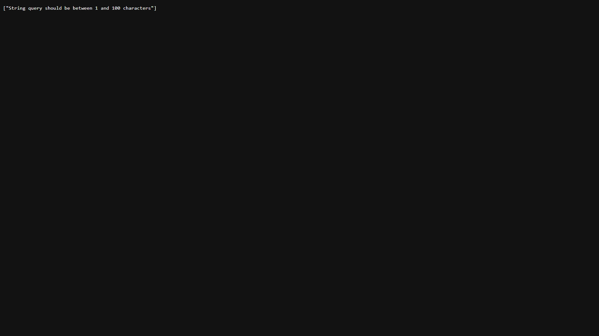

<h2>Test task</h2>
<h3>Инструкция по запуску:</h3>

Открыть в терминале папку с проектом, запустить проект с помощью команды docker compose up. Приложение будет доступно по адресу: http://localhost:8080/

Запуск тестов доступен с помощью команды mvn clean test в папке проекта.

Также запуск приложения или тестов доступен с помощью среды разработки.

<h3>Формат входящих параметров</h3>

Входящий параметр - строка, состоящая из 1-100 символов, которая вводится в форму на главной странице приложения.

<h3>Формат исходящих ответов</h3>

Приложение возвращает ответ в формате JSON. 
В случае валидного запроса будет возвращен JSON с перечислением символов из строки и количества их вхождений.
В случае невалидного запроса будет возвращен JSON с перечислением ошибок, из-за которых была провалена валидация.

<h3>Используемые технологии:</h3>
<ul>
<li>Java 17</li>
<li>Spring boot 3.2.2</li>
<li>Maven</li>
<li>Thymeleaf</li>
<li>Lombok</li>
<li>JUnit 5</li>
<li>Docker</li>
</ul>

<h3>Скриншоты с примерами запросов и ответов</h3>

Валидный запрос и ответ на него:

Неалидный запрос (пустая строка) и ответ на него:

Неалидный запрос (длинная строка) и ответ на него:

